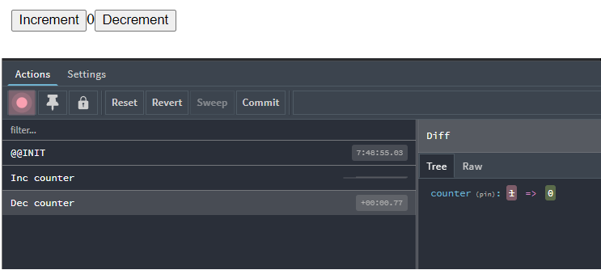

## Dlog is

dlog function that allows log mutation actions that are being dispatched to `rx js` flux store from `@zambezi/caballo-vivo` using `Redux DevTools`

```javascript
incAction$.pipe(map(dlog('Increment action')))
```


